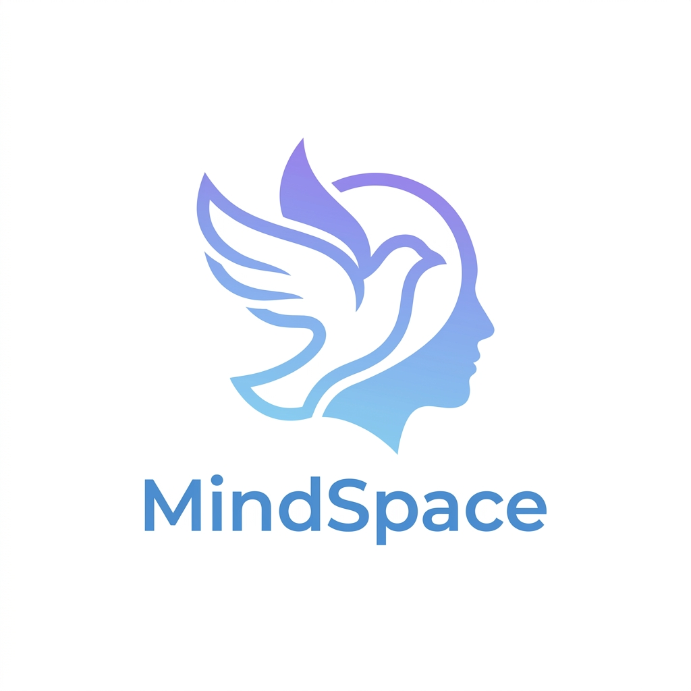

# 🌿 MindSpace - Mental Health & NGO Support Platform

**MindSpace** is a premium, empathetic mental health support platform designed to bridge the gap between individuals seeking help and NGO consultants. It combines AI-driven personal reflection tools with a high-end, real-time crisis intervention dashboard.



## 🚀 Key Features

### 🏢 NGO Pro Dashboard (Consultant Side)
A professional-grade command center for mental health consultants:
*   **Live Support Queue**: Real-time listing of active users with urgency indicators (2-min wait pulse).
*   **Presence Awareness**: 🟢 Green / 🌙 Grey status dots powered by real-time Socket.io heartbeats.
*   **Empathy Toolkit**: Canned empathetic responses to speed up crisis intervention.
*   **User Context**: Real-time stress index tracking and deep links to user mood history.
*   **Unread Notifications**: Purple glow indicators for incoming messages in background chats.

### 📝 AI-Driven Personal Sanctuary (User Side)
A private space for honest reflection:
*   **Mood-Aware Diary**: Real-time scanning of entries for emotional triggers (Happy, Sad, Anxious).
*   **AI Insights**: Personalized motivations and grounding techniques based on written reflections.
*   **Offline-Ready**: Local storage fallback ensures your sanctuary is always accessible, even without internet.
*   **Mood Tracker**: Interactive daily check-ins to visualize emotional trajectory.

### 💬 Community & Healing
*   **Anonymous Community Chat**: A safe space for peer support.
*   **Relaxation Suite**: Curated tools for immediate stress relief (Breathing exercises, Healing sounds).

---

## 🛠️ Technology Stack

*   **Server**: Node.js & Express
*   **Database**: MongoDB (Mongoose ODM)
*   **Real-time**: Socket.io (Standardized Event API)
*   **Intelligence**: Google Gemini AI (Diary Analysis)
*   **Frontend**: Vanilla JavaScript (ES6+), HTML5, CSS3 (Glassmorphism Aesthetic)
*   **Authentication**: JWT (JSON Web Tokens) with Secure Local Storage

---

## ⚙️ Setup & Installation

### Prerequisites
*   Node.js (v16+)
*   MongoDB Instance (Local or Atlas)
*   Gemini AI API Key (Optional, for AI features)

### 1. Clone & Install
```bash
git clone https://github.com/PuranjayParimi-21/MindSpace.git
cd MindSpace
npm install
```

### 2. Environment Configuration
Create a `.env` file in the root directory:
```env
PORT=3000
MONGODB_URI=your_mongodb_connection_string
JWT_SECRET=your_secure_random_secret
GEMINI_API_KEY=your_google_ai_key
```

### 3. Initialize Data (Optional)
```bash
node seedMentors.js  # Populate initial NGO consultants
```

### 4. Run Locally
```bash
npm start
```
The application will be available at `http://localhost:3000`.

---

## 📡 Standardized Socket API
MindSpace uses a clean, unified event system for all support communications:
*   `join_chat`: Join a unique session room based on `userId`.
*   `register_user_status`: Registers the user as 🟢 Online.
*   `send_message` / `receive_message`: Core messaging pipe.
*   `support_typing` / `support_stop_typing`: Real-time active indicators.

---

## 🕊️ Mission
MindSpace was built with the belief that no one should face their heaviest moments alone. Our mission is to provide technology that enhances human empathy, not replaces it.

**Built for NGOs, designed for people.**
